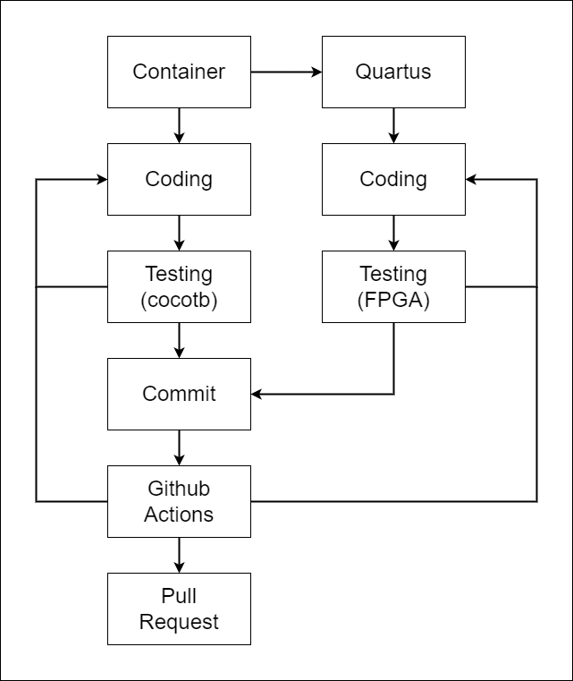

# Desenvolvimento de RISC-V para Aplicações Aeroespaciais

- Instituição: Insper Instituto de Ensino e Pesquisa
- Curso: Computer Engineering, 8th Semester
- Mentor: Saulo Finco
- Organização: Centro de Tecnologia da Informação Renato Archer
- Ano: 2024

## Resumo

O objetivo deste projeto é desenvolver um processador RISC-V para aplicações aeroespaciais, garantindo sua qualidade por meio de uma pipeline CI/CD, que é uma prática de automação onde o processo de desenvolvimento está separado em etapas. 

## Introdução

A instituição "Insper Instituto de Ensino e Pesquisa" (Insper) é uma organização sem fins lucrativos, e este projeto foi desenvolvido por três alunos da graduação do curso de engenharia da computação, em conjunto com a organização governamental "Centro de Tecnologia da Informação Renato Archer" (CTI).

## Visão Abrangente do projeto

Este projeto foi desenvolvido em duas vertentes: o desenvolvimento dos componentes individuais, testados por cocotb, e o desenvolvimento da CPU, testada na placa FPGA

# Referências
- Edington, A. A.; Domingues, B. S.; Vale, L. L.; Santos, R. D. **Conformance Tester for Tags EPC-GEN2 UHF RFID**. Insper, 2021. Available at: https://pfeinsper.github.io/21b-indago-rfid-conformance-tester/

